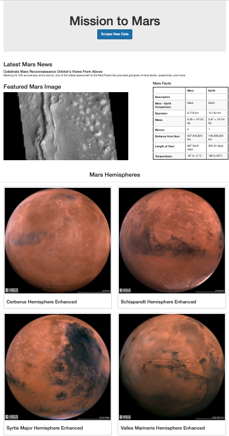

# Mission-to-Mars

## Overview of the Analysis

The purpose of this analysis was to build our skills on web scraping methods. The lessons were based on automating a web browser to visit different websites and extract data. Additionally, we gained knowledge using HTML elements and attributes in order to identify content for web scraping. The main goal of the task was put together a web-scraping project about the Mission to Mars.

The final analysis required the creation of three technical analysis:

1. Scrape Full-Resolution Mars Hemisphere images with titles.
2. Create and update a web application with Mars Hemisphere images and titles.
3. Add Bootstrap components to the app.

During this process, we used BeautifulSoup and Splinter to automate a web browser and conduct a web scrape. A MongoDB database and a web application with Flask were created to store and display the data from the web scrape. The final step was executed using Bootstrap components to polish and customize the app created to showcase the project. 

## Resources

- Flask
- NoSQL Mongo database
- HTML elements
- BeautifulSoup & Splinter
- Bootstrap
- Python, Jupyter Notebook, and VSCode

## Fig.1
 
 ### Mission to Mars app before changes

## Fig. 2

### Misiion to Mars app after changes

