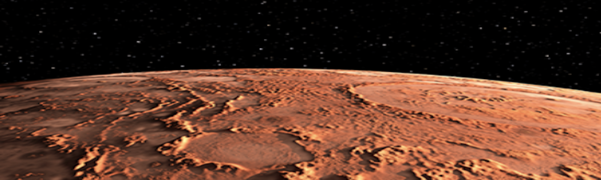

# Mission-to-Mars

## Overview

The purpose of this assignment was to create a web scraping project about the Mission to Mars. Various tools were needed to extract information from active websites. For a successful scrape, Chrome Developer was used to identify the HTML components attached to the desired data. BeautifulSoup and Splinter was used to automate the scrape, and MongoDB (a NoSQL database) to store the data. To display it, a web application using Flask was created. 

The web application was built using a combination of HTML and CSS. Once built, a Python script was written using BeautifulSoup and Splinter to extract the data needed for the analysis. 

A button was added to execute the scraping code and update the pages to display the newest data. Bootstrap components were also used to customize and polish the web application created to showcase the project.

The final process for the web-scraping project required the creation of three technical analysis:

1. Scrape Full-Resolution Mars Hemisphere images with titles.
2. Create and update a web application with Mars Hemisphere images and titles.
3. Add Bootstrap components to the app.

 
## Resources

- Flask
- MongoDB (NoSQL database)
- HTML elements
- BeautifulSoup & Splinter
- Bootstrap
- Python, Jupyter Notebook, and VSCode
- Chrome Developer

## Fig.1
 
 ### Mission to Mars App (before changes)

## Fig. 2

### Mission to Mars App (after changes)

